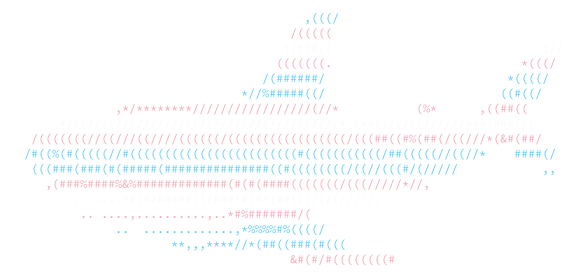

<p align="center">
  
</p>
<h1 align="center">BLÅHAJ</h1>
<h4 align="center">Gay sharks at your local terminal</h4>
<p align="center">
  <br />
    <a href="https://github.com/GeopJr/BLAHAJ/blob/main/CODE_OF_CONDUCT.md"></a>
    <a href="https://github.com/GeopJr/BLAHAJ/blob/main/LICENSE"></a>
    <a href="https://github.com/GeopJr/BLAHAJ/actions"></a>
</p>

# What is BLÅHAJ?

Apart from [a cute cuddly shark plushie from IKEA](https://www.ikea.com/us/en/p/blahaj-soft-toy-shark-90373590/), BLÅHAJ is a lolcat-like CLI tool that colorizes your input, shows flags and prints colorful sharks!

It has a wide variety of flags/colors to choose from and many options from flag size to whether to colorize by line, word or character.

# Installation

## Pre-built

You can download one of the statically-linked pre-built binaries from the [releases page](https://github.com/GeopJr/BLAHAJ/releases/latest).

They are built & published by our lovely [actions](https://github.com/GeopJr/BLAHAJ/actions/workflows/release.yml).

## AUR

Arch Linux users can install the [blahaj](https://aur.archlinux.org/packages/blahaj) (or the [blahaj-git](https://aur.archlinux.org/packages/blahaj-git)) AUR package.

## Docker

```
docker run --rm -it --name blahaj ghcr.io/geopjr/blahaj -h
```

## Building

### Dependencies

- `crystal` - `1.8.0`

### Makefile

- `$ make` (or `$ make static` on Alpine Linux for a static build)
- `# make install`

# FAQ

## Why are only striped flags allowed?

Flags with eg. triangles, circles or symbols, need enough horizontal space to determine where and how to display them. BLÅHAJ can't know in advance how long the input is going to be.

## Why are the stripes repeating instead of showing the flag in full?

Just like the previous question, BLÅHAJ can't know how long the text is going to be (vertically) since it colorizes the input as it comes in.

## I would like to add a color scheme or flag

Great! Follow the [Contributing section](#contributing) and modify [data/colors.yaml](./data/colors.yaml).

```yaml
flag name:
  color:
    - hex color
    - per
    - stripe
  alias:
    - aliases
    - if any
```

# Examples

```
$ blahaj -h

BLÅHAJ v2.2.0

Usage:
    blahaj [arguments]
    blahaj [arguments] file
    command | blahaj [arguments]

Examples:
    blahaj -c trans ~/.bashrc
    blahaj -s -b
    neofetch | blahaj -c gay
    blahaj -f -c lesbian -m 4
    blahaj -w /etc/os-release

Arguments:
    -b, --background                 Color the background
    -s, --shark                      Shork
    -f, --flag                       Return a flag
    -i, --individual                 Color individual characters
    -w, --words                      Color individual words
    -m MULTIPLIER, --multiplier=MULTIPLIER
                                     Multiplier for the flag size (-f)
    -c FLAG, --colors=FLAG           Color scheme to use (Default: trans)
    -r, --random                     Use a random color scheme
    --flags                          List all available flags
    -h, --help                       Show this help
```

## Shark (`-s`), flag (`-f`), flag with 2x multiplier (`-f -m 2`)


## Pipe, individual characters instead of rows (`-i`)


## Read from file, background instead of foreground (`-b`), individual words instead of rows (`-w`)

> Notice how the foreground color changes based on the background color.


## Pipe, default color scheme


> All images above include ALT text and you are encouraged to read it, if you find parts of them confusing, by using screen readers, hovering over them with your cursor or looking at the source.

# Custom flags at runtime

You can pass a local [`./data/colors.yaml`](./data/colors.yaml) file at runtime to the `BLAHAJ_COLORS_YAML` env var and BLÅHAJ will parse it. This can also be used to override the already defined flags.


(The custom file needs to follow the [`./data/colors.yaml`](./data/colors.yaml) format)

# Contributing

1. Read the [Code of Conduct](https://github.com/GeopJr/BLAHAJ/blob/main/CODE_OF_CONDUCT.md)
2. Fork it ( https://github.com/GeopJr/BLAHAJ/fork )
3. Create your feature branch (git checkout -b my-new-feature)
4. Commit your changes (git commit -am 'Add some feature')
5. Push to the branch (git push origin my-new-feature)
6. Create a new Pull Request

# Sponsors

<p align="center">

[](https://github.com/sponsors/GeopJr)

</p>
